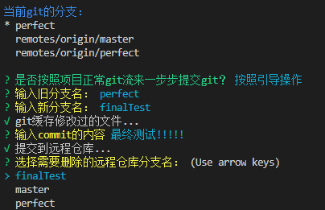
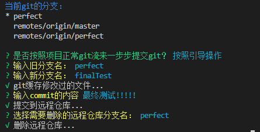

# GitTask


A plugin CLI to task your git operations.将git命令模块组合的CLI插件
> Author：Alan Chen

> E-mail: 739709491@qq.com

> version: 0.0.6

> date: 2018/11/16

> 只能通过node来执行

## Feature
* 将常用的git命令业务组件化，然后像使用插槽一样自定义git的工作流。
* 内置14个常用命令扩展，全部是CLI中文操作，高效便捷。
* 支持自定义命令扩展，支持链式顺序执行，支持链式命令扩展之间参数传递。

## Directory tree
``` 
├─example       demo代码
├─screenshot    效果截图
└─src
    └─commands  内置的命令扩展
```




## Usage
* `yarn add @alanchenchen/gittask` or `npm install @alanchenchen/gittask --save` 安装依赖
* 在项目根目录新建一个js文件，例如`wrok.js`，在其中调用如下：
```js
    const { WorkFlow } = require('@alanchenchen/gittask')
    const questFlow = require('@alanchenchen/gittask/src/commands/questFlow')
    const showBranch = require('@alanchenchen/gittask/src/commands/showBranch')
    const modifyOldBranch = require('@alanchenchen/gittask/src/commands/modifyOldBranch') 
    const addModifiedFile = require('@alanchenchen/gittask/src/commands/addModifiedFile') 
    const commit = require('@alanchenchen/gittask/src/commands/commit') 
    const push = require('@alanchenchen/gittask/src/commands/push') 
    const deleteOrigin = require('@alanchenchen/gittask/src/commands/deleteOrigin')

    /* 插件内置13个常用的命令扩展，先引入，然后自由组合，task内会按照索引顺序依次执行 */
    const task = [showBranch, questFlow, modifyOldBranch, addModifiedFile, commit, push, deleteOrigin]
    WorkFlow.use(task)

```
* 然后在当前目录工作区打开终端，输入`node work`,接下来就可以按照CLI的流程一步步操作啦~

## Options
* gittask包导出3个变量：
    1. `WorkFlow`, `[Object]`, 包含一个可以使用的方法`use`。`use`支持传入一个数组，数组项必须是命令扩展(可以是自己定义的)
    2. `git`, `[Object]`, 包含内置的13个命令扩展的命令参数。
    3. `shell`, `[Function]`, 运行命令行的函数。参数如下：
        * `cmd` `[Array]`, 必选，命令的参数数组，例如`git branch -a`，cmd则是`['branch', '-a']`
        * `param` `[Array]`, 可选，默认命令参数后面的参数，默认为空数组，例如`git branch alan`，cmd是`['branch']`，param则是`['alan']`
        * `prefixPath` `[String]`, 可选，命令行运行的程序路径，默认为`git`，可以是其他命令路径，支持非git操作
    
    > 13种内置命令扩展

    | name           |      description                   |  return value (扩展返回值)|
    |:--------------:|:----------------------------------:|:------------------------:|
    | addModifiedFile| 将项目中发生改变的文件添加到git缓存   | 透传上一个扩展传来的值 |
    | checkoutBranch | 切换当前分支到指定分支               | 用户选择的新分支名 |
    | checkVersion   | 显示当前git的版本信息                | / |
    | commit         | 将git中的缓存提交到commit操作        | 透传上一个扩展传来的值 |
    | deleteBranch   | 删除本地仓库某个分支                 | / |
    | deleteOrigin   | 删除远程仓库某个分支                 | / |
    | modifyOldBranch| 将某个分支名替换为新的分支名，命名分支 | 用户选择的新分支名 |
    | newBranch      | 新建一个本地分支                     | 用户选择的新分支名 |
    | pull           | 拉取指定分支的远程仓库 | 用户选择的拉取分支名 |
    | push           | 将指定分支的文件提交到远程仓库，默认会取addModifiedFile传入的新分支名，如果没有，则会提交当前分支| / |
    | questFlow      | 询问用户是否按照git工作流来配置的提问 | / |
    | showBranch     | 显示当前所有分支，包含远程分支        | / |
    | showLog        | 显示当前分支的log日志                | / |
    | showStatus     | 显示当前分支文件的状态，只有当有状态变化，才能调用addModifiedFile| / |

* 插件支持自定义命令扩展，但是格式必须如下：
```js
    const chalk = require('chalk') // 让终端可写流文本颜色改变的模块
    const inquirer = require('inquirer') // 终端可读流交互的模块
    const { git, shell } = require('@alanchenchen/gittask') // 插件自带的shell方法和默认git参数

    // 一定要导出一个异步函数,可选接收一个参数，param是task中前一个命令扩展传入的参数
    module.exports = async (param) => {
        await shell(['-V'],[], 'node') // 异步打印出当前node版本号
        return '我是传入给下一个命令扩展的参数' // return会将参数传入给task中下一个命令扩展，可以不传
    }

```

## License
* MIT
